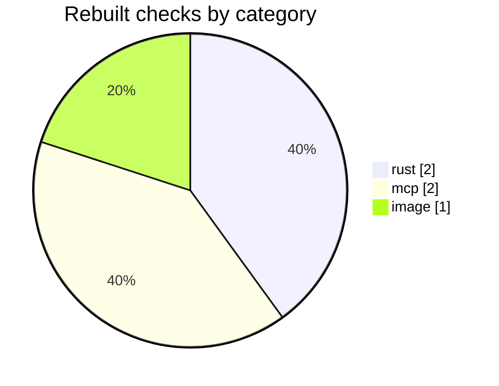
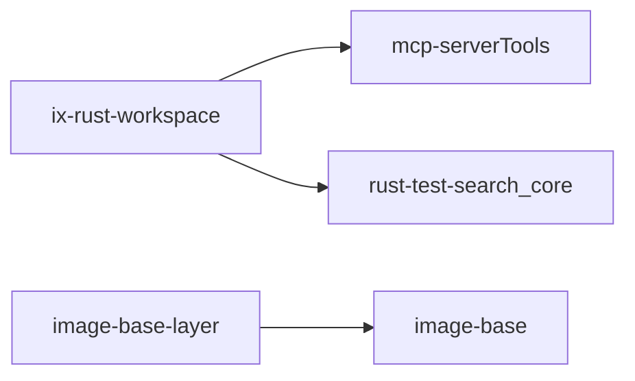

<!-- blast-radius -->
### Blast radius

`4` of `120` checks would rebuild between base `aaaaaaa` and head `bbbbbbb`.

1 added, 0 removed

changed checks

- mcp-serverTools
- rust-test-search_core
- image-base

